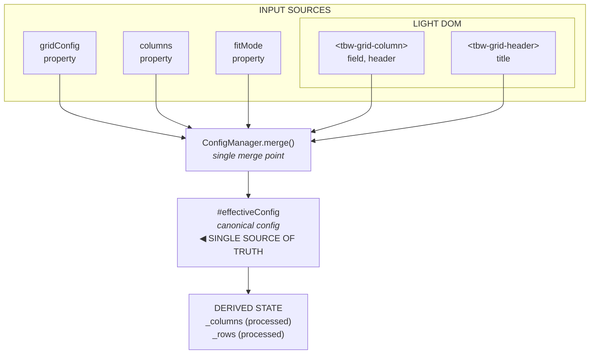
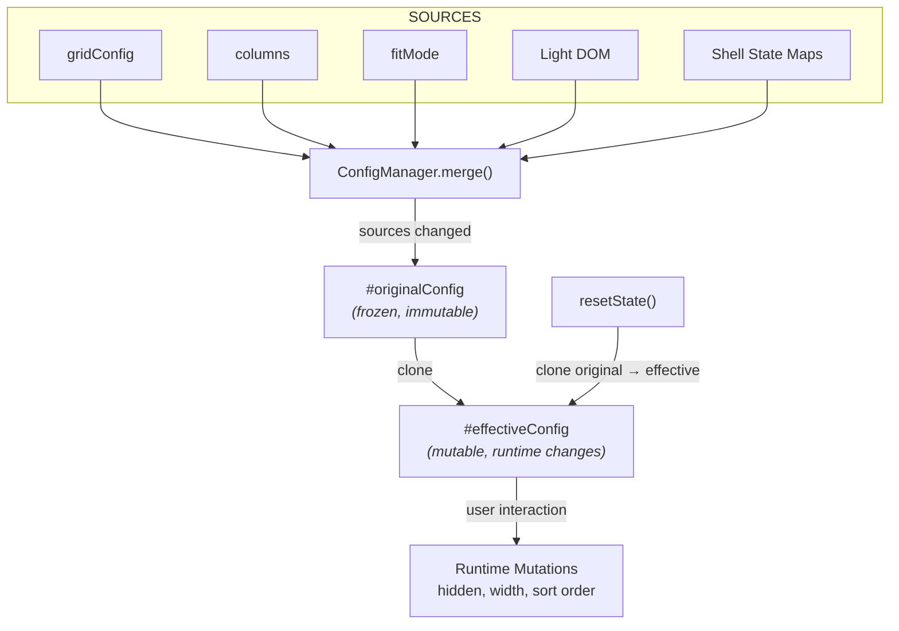
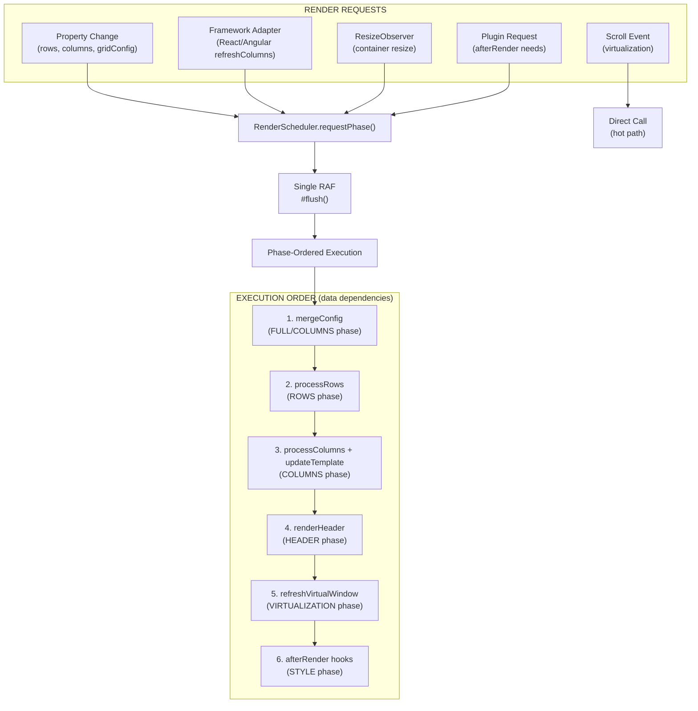
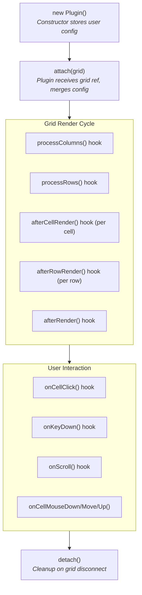

This page describes the internal architecture of `@toolbox-web/grid`. It's intended for contributors, plugin developers, and anyone who wants to understand how the grid works under the hood.

## Design Philosophy

1. **Light DOM** — No Shadow DOM. The grid renders directly into the element, allowing full CSS customization.
2. **Single Source of Truth** — All configuration converges into `effectiveConfig`, which is the only state read by rendering logic.
3. **Plugin-First** — Features like selection, editing, and filtering are plugins, not core code. This keeps the core small and tree-shakeable.
4. **Web Standards** — Built on Custom Elements, CSS Custom Properties, `adoptedStyleSheets`, and standard DOM APIs.
5. **Framework-Agnostic** — Pure TypeScript/HTML, no runtime framework dependencies.

## Component Overview

```
┌───────────────────────────────────────────────────────┐
│                        <tbw-grid>                     │
│  ┌─────────────────────────────────────────────────┐  │
│  │                    Light DOM                    │  │
│  │  ┌───────────────────────────────────────────┐  │  │
│  │  │              Header Row                   │  │  │
│  │  └───────────────────────────────────────────┘  │  │
│  │  ┌───────────────────────────────────────────┐  │  │
│  │  │           Rows Viewport (scrollable)      │  │  │
│  │  │  ┌─────────────────────────────────────┐  │  │  │
│  │  │  │  Spacer (virtual scroll height)     │  │  │  │
│  │  │  ├─────────────────────────────────────┤  │  │  │
│  │  │  │  Visible Rows (row pool)            │  │  │  │
│  │  │  └─────────────────────────────────────┘  │  │  │
│  │  └───────────────────────────────────────────┘  │  │
│  └─────────────────────────────────────────────────┘  │
└───────────────────────────────────────────────────────┘
```

## Component Lifecycle

```
constructor()
  └── Create internal state objects
  └── Initialize render scheduler

connectedCallback()
  └── Parse light DOM children (<tbw-grid-column>, <tbw-grid-header>)
  └── Merge configuration (gridConfig + columns + fitMode + light DOM)
  └── Attach plugins (validate dependencies, call onAttach)
  └── Render header + rows
  └── Set up scroll listener, resize observer

attributeChangedCallback()
  └── Map attribute → property setter

disconnectedCallback()
  └── Abort disconnect signal (plugins clean up)
  └── Remove event listeners
  └── Disconnect resize observer
```

---

## Configuration Architecture

The grid follows a **single source of truth** pattern. All configuration inputs converge into one `effectiveConfig` object, which is then used for all rendering and behavior.

### Why Single Source of Truth?

- **Predictable behavior**: One canonical config means no ambiguity about which setting applies
- **Easy debugging**: Inspect `effectiveConfig` to see exactly what the grid is using
- **Flexible input**: Users can configure via the method most convenient for their use case
- **Plugin-friendly**: Plugins can read/modify config through one consistent interface

### Input Sources

Users can configure the grid through multiple input methods:



### Precedence Rules

When the same property is set via multiple sources, higher precedence wins:

| Priority    | Source                | Example                                      |
| ----------- | --------------------- | -------------------------------------------- |
| 1 (lowest)  | HTML attributes       | `<tbw-grid rows='[...]' fit-mode="stretch">` |
| 2           | `gridConfig` property | `grid.gridConfig = { fitMode: 'stretch' }`   |
| 3           | Light DOM elements    | `<tbw-grid-column field="name">`             |
| 4           | `columns` property    | `grid.columns = [{ field: 'name' }]`         |
| 5           | Inferred columns      | (auto-detected from first row)               |
| 6 (highest) | Individual props      | `grid.fitMode = 'fixed'`                     |

### HTML Attribute Configuration

The grid supports JSON-serialized configuration via HTML attributes:

```html
<tbw-grid
  rows='[{"id":1,"name":"Alice"},{"id":2,"name":"Bob"}]'
  columns='[{"field":"id","header":"ID"},{"field":"name","header":"Name"}]'
  fit-mode="stretch"
>
</tbw-grid>
```

Supported attributes: `rows`, `columns`, `grid-config`, `fit-mode`.

### Light DOM Configuration

The grid parses these light DOM elements on connection:

```html
<tbw-grid>
  <!-- Column definitions (→ effectiveConfig.columns) -->
  <tbw-grid-column field="name" header="Name" sortable></tbw-grid-column>
  <tbw-grid-column field="age" header="Age" type="number"></tbw-grid-column>

  <!-- Shell header (→ effectiveConfig.shell.header) -->
  <tbw-grid-header title="My Data Grid">
    <tbw-grid-header-content>
      <span>Custom content here</span>
    </tbw-grid-header-content>
    <tbw-grid-tool-button label="Refresh" icon="🔄"></tbw-grid-tool-button>
  </tbw-grid-header>
</tbw-grid>
```

### Internal State Categories

| Category | Example | Description |
|----------|---------|-------------|
| **Input Properties** | `#rows`, `#columns`, `#gridConfig`, `#fitMode` | Raw user input, stored as-is |
| **Effective Config** | `#effectiveConfig` | Merged canonical config — single source of truth |
| **Derived State** | `_columns`, `_rows` | Post-plugin-processing state used by rendering |
| **Runtime State** | `#hiddenColumns`, `sortState` | User-driven state changes (hide column, sort, etc.) |

**Key rule:** Rendering logic reads from `effectiveConfig` or derived state, never from input properties.

---

### Two-Layer Config Architecture

ConfigManager implements a two-layer architecture to separate the **original configuration** (from sources) from **runtime mutations**:



**Layer 1: Original Config (`#originalConfig`)**

- Built from all sources via `#collectAllSources()`
- Frozen after creation (`Object.freeze`)
- Immutable — never modified after merge
- Serves as the "reset point" for the effective config

**Layer 2: Effective Config (`#effectiveConfig`)**

- Deep cloned from original config
- Mutable — runtime changes go here
- Column visibility, widths, sort order, etc.
- All rendering reads from this layer

**Key Behaviors:**

| Operation                                 | What Happens                                               |
| ----------------------------------------- | ---------------------------------------------------------- |
| Source changes (gridConfig, columns, etc.) | `markSourcesChanged()` → `merge()` rebuilds both layers   |
| Runtime mutation (hide column, resize)     | Modify `effectiveConfig` only, `original` untouched        |
| `resetState()`                             | Clone `original` → `effective`, discarding runtime changes |
| `collectState()`                           | Diff `effective` vs `original` to get user changes         |

**When Sources Change:**

Sources are re-collected only when `#sourcesChanged` is `true` AND columns already exist:

1. Setting `gridConfig`, `columns`, `fitMode` → auto-marks sources changed
2. Setting Light DOM columns → auto-marks sources changed
3. Shell state updates → call `markSourcesChanged()` explicitly
4. `merge()` is a no-op if sources haven't changed AND columns exist
5. If no columns exist yet, `merge()` always runs (to allow inference from rows)

This optimization prevents unnecessary rebuilds when `merge()` is called multiple times per frame.

---

## Rendering Pipeline

All rendering flows through a centralized **RenderScheduler** that batches all work into a single `requestAnimationFrame` callback. This eliminates race conditions between different parts of the grid that previously scheduled independent RAFs.

### Render Scheduler Architecture



### Render Phases

Work is organized into ordered phases. Multiple requests merge to the **highest requested phase**:

| Phase | Priority | Work Performed |
|-------|----------|----------------|
| `STYLE` | 1 | Plugin `afterRender()` hooks only |
| `VIRTUALIZATION` | 2 | Recalculate virtual window (+ STYLE) |
| `HEADER` | 3 | Re-render header row (+ VIRTUALIZATION) |
| `ROWS` | 4 | Rebuild row model (+ HEADER) |
| `COLUMNS` | 5 | Process columns, update CSS template (+ ROWS) |
| `FULL` | 6 | Merge effective config (+ COLUMNS) |

Higher phases implicitly cover all lower phases. Requesting `COLUMNS` when `ROWS` is already pending results in just `COLUMNS` executing.

**Example**: If React adapter requests `COLUMNS` and ResizeObserver requests `VIRTUALIZATION` in the same frame, only `COLUMNS` phase runs (which includes all lower phases).

### Execution Order in `#flush()`

```typescript
if (phase >= RenderPhase.COLUMNS) mergeConfig();
if (phase >= RenderPhase.ROWS)    processRows();
if (phase >= RenderPhase.COLUMNS) processColumns();
if (phase >= RenderPhase.COLUMNS) updateTemplate();
if (phase >= RenderPhase.HEADER)  renderHeader();
if (phase >= RenderPhase.VIRTUALIZATION) renderVirtualWindow();
if (phase >= RenderPhase.STYLE)   afterRender();
```

### Intentional Bypasses

Some operations intentionally bypass the scheduler for performance:

| Operation              | Reason                                     |
| ---------------------- | ------------------------------------------ |
| Scroll rendering       | Hot path — must be synchronous for 60fps   |
| Shell rebuild          | Creates DOM structure, not content updates |
| Row height measurement | One-time post-paint measurement            |

### Debugging Renders

```typescript
// In browser console
grid._scheduler.setDebug(true);

// After interactions, inspect:
grid._scheduler.getRenderLog();
// → [{ phase: 5, source: 'applyGridConfigUpdate', timestamp: 1234.56 }, ...]
```

---

## Virtualization

### Row Virtualization (Built-in)

The grid maintains a "virtual window" — an offset and count representing which rows are visible:

```
Total rows: 10,000
Viewport: 400px, rowHeight: 28px → ~14 visible rows
Overscan: 8 rows above + 8 below = 30 DOM rows in pool

Scroll position: 5,000px → startIndex: 178
Rendered: rows 170–200 (30 rows in DOM)
```

- **Row pool**: DOM rows are reused, not created/destroyed on scroll
- **Transform-based positioning**: Each row uses `transform: translateY()` for GPU-accelerated positioning
- **Range-based updates**: Only rows entering/leaving the viewport get updated content

For very small datasets (≤8 rows by default), virtualization is bypassed — the overhead isn't worth it.

### Column Virtualization (Plugin)

The `ColumnVirtualizationPlugin` applies the same window concept horizontally. Only columns visible in the horizontal scroll position are rendered.

---

## Plugin System

### Plugin Lifecycle



### Creating a Plugin

```typescript
import { BaseGridPlugin, CellClickEvent } from '@toolbox-web/grid';
import styles from './my-plugin.css?inline';

interface MyPluginConfig {
  enabled?: boolean;
}

export class MyPlugin extends BaseGridPlugin<MyPluginConfig> {
  readonly name = 'myPlugin';
  override readonly styles = styles;

  protected override get defaultConfig(): Partial<MyPluginConfig> {
    return { enabled: true };
  }

  override attach(grid: GridElement): void {
    super.attach(grid); // MUST call super
    // Setup listeners with this.disconnectSignal for auto-cleanup
  }

  override afterRender(): void {
    if (!this.config.enabled) return;
    // Access DOM via this.gridElement
  }

  override onCellClick(event: CellClickEvent): boolean | void {
    // Return true to prevent default behavior
  }
}
```

### Plugin Communication

**Event Bus** (async, fire-and-forget):

```typescript
// Emit
this.emitPluginEvent('selection-cleared', { source: 'keyboard' });

// Listen
this.onPluginEvent('selection-cleared', (detail) => { /* ... */ });
```

**Query System** (sync, request-response):

```typescript
// Register handler
this.registerQuery('getSelectedRanges', () => this.#ranges);

// Query from another plugin
const ranges = this.queryPlugin('getSelectedRanges');
```

### Plugin Manifest

Plugins declare owned config properties via a static `manifest`:

```typescript
static override readonly manifest = {
  ownedProperties: ['editable', 'editor', 'editOn'],
  configRules: [
    { property: 'editable', type: 'column', rule: 'requires-plugin' },
  ],
};
```

The grid validates at runtime that properties like `editable: true` are only used when the owning plugin is loaded, and provides helpful error messages with import hints.

---

## Runtime Configuration Validation

The grid validates plugin-owned properties at runtime and throws helpful errors if required plugins are missing.

### Validated Properties

| Property       | Required Plugin         | Level  |
| -------------- | ----------------------- | ------ |
| `editable`     | `EditingPlugin`         | Column |
| `editor`       | `EditingPlugin`         | Column |
| `group`        | `GroupingColumnsPlugin` | Column |
| `sticky`       | `PinnedColumnsPlugin`   | Column |
| `columnGroups` | `GroupingColumnsPlugin` | Config |

Validation runs in the `RenderScheduler.mergeConfig` callback, **after** plugins are initialized. Error messages clearly state which plugin is missing and how to import it.

---

## DOM Structure

```html
<tbw-grid aria-label="..." role="grid">
  <div class="data-grid-container">
    <!-- Header -->
    <div role="rowgroup">
      <div role="row" aria-rowindex="1">
        <div role="columnheader" aria-colindex="1">Name</div>
        <div role="columnheader" aria-colindex="2">Age</div>
      </div>
    </div>

    <!-- Body (scrollable, virtualized) -->
    <div role="rowgroup" class="data-grid-body">
      <div role="row" aria-rowindex="2" style="transform: translateY(0px)">
        <div role="gridcell" aria-colindex="1">Alice</div>
        <div role="gridcell" aria-colindex="2">30</div>
      </div>
    </div>
  </div>
</tbw-grid>
```

---

## Styling Architecture

### CSS Custom Properties

All styling uses CSS custom properties for theming:

```css
tbw-grid {
  --tbw-color-bg: #ffffff;
  --tbw-color-fg: #1a1a1a;
  --tbw-color-border: #e5e5e5;
  --tbw-color-header-bg: #f5f5f5;
  --tbw-row-height: 28px;
  --tbw-header-height: 32px;
  --tbw-font-family: system-ui, sans-serif;
  --tbw-font-size: 13px;
}
```

### Key CSS Architecture

- **CSS Nesting**: Styles use `tbw-grid { .data-grid-container { ... } }` for scoping
- **Cascade Layers**: `@layer tbw-base, tbw-plugins, tbw-theme` — user styles always win
- **Adopted Stylesheets**: Dynamic styles use `document.adoptedStyleSheets` for efficiency — styles survive `replaceChildren()` calls
- **`em`-Based Sizing**: Row height, padding, and spacing scale with `font-size`

### Plugin Styles

Plugins inject CSS via their `styles` property using adopted stylesheets. They use a layered fallback pattern for flexibility:

```css
/* Plugin-specific → Global fallback */
background: var(--tbw-selection-bg, var(--tbw-color-selection));
```

---

## Event Flow

The grid dispatches `CustomEvent`s for every user-visible action (cell clicks, commits, sort changes, etc.). See the [Events section of the API Reference](/grid/api-reference/#events) for the full list and the auto-generated [`DataGridEventMap`](/grid/api/core/interfaces/datagrideventmap/) for payload types.

Internally, plugins communicate through two mechanisms described in the [Plugin Communication](#plugin-communication) section above: the **Event Bus** (async, fire-and-forget) and the **Query System** (sync, request-response). Public `CustomEvent`s are dispatched by the core grid or by individual plugins after their internal processing completes.

### Data Flow Example: Sort

```
User clicks sort header
  ↓
Header click handler → update sortState
  ↓
Call processRows() on all plugins (MultiSortPlugin sorts)
  ↓
_rows updated with sorted order
  ↓
scheduler.requestPhase(ROWS, 'sort')
  ↓
requestAnimationFrame
  ↓
Render: update visible row content from new _rows
```

---

## Performance

### DOM Optimization

| Technique | Benefit |
| --- | --- |
| **Template Cloning** | 3–4× faster than `createElement` |
| **Direct DOM Construction** | Avoids innerHTML parsing overhead |
| **DocumentFragment** | Single reflow per row |
| **Row Pooling** | Zero allocation during scroll |
| **Cached DOM Refs** | Avoid querySelector per scroll |

### Rendering Pipeline

| Technique | Benefit |
| --- | --- |
| **Centralized Scheduler** | Eliminates race conditions |
| **Phase-Based Execution** | No duplicate work |
| **adoptedStyleSheets** | Survives DOM rebuilds, zero overhead |
| **Idle Scheduling** | Faster time-to-interactive |
| **Fast-Path Patching** | Skip expensive template logic for plain text |
| **Cell Display Cache** | Avoid recomputing during scroll |

### Event Handling

| Technique | Benefit |
| --- | --- |
| **Event Delegation** | Constant memory regardless of rows |
| **Pooled Scroll Events** | Zero GC pressure during scroll |
| **AbortController Cleanup** | No memory leaks on disconnect |

---

## Directory Structure

```
libs/grid/src/
├─ index.ts                # Main entry (auto-registers element)
├─ public.ts               # Public API surface (types, constants)
├─ all.ts                  # All-in-one bundle with all plugins
└─ lib/
   ├─ core/
   │  ├─ grid.ts             # Main component class
   │  ├─ grid.css            # Core styles
   │  ├─ types.ts            # Public type definitions
   │  ├─ constants.ts        # DOM class/attribute constants
   │  ├─ internal/           # Pure helper functions
   │  │  ├─ columns.ts        # Column resolution, sizing
   │  │  ├─ config-manager.ts # Config lifecycle & column state
   │  │  ├─ dom-builder.ts    # Direct DOM construction
   │  │  ├─ render-scheduler.ts # RAF-based render batching
   │  │  ├─ rows.ts           # Row rendering
   │  │  ├─ virtualization.ts # Virtual scroll math
   │  │  └─ ...              # More internal helpers
   │  └─ plugin/             # Plugin infrastructure
   │     ├─ base-plugin.ts    # Abstract base class
   │     └─ plugin-manager.ts # Plugin lifecycle
   └─ plugins/               # Built-in plugins
      ├─ editing/             # Inline cell editing
      ├─ filtering/           # Column filters
      ├─ selection/           # Row/cell/range selection
      ├─ multi-sort/          # Multi-column sorting
      └─ ...                 # 20+ more plugins
```

## See Also

- [Custom Plugins](/grid/guides/custom-plugins/) — Build your own plugins
- [Performance Guide](/grid/guides/performance/) — Render scheduler tuning
- [Plugins Overview](/grid/plugins/) — Available plugins and their hooks
