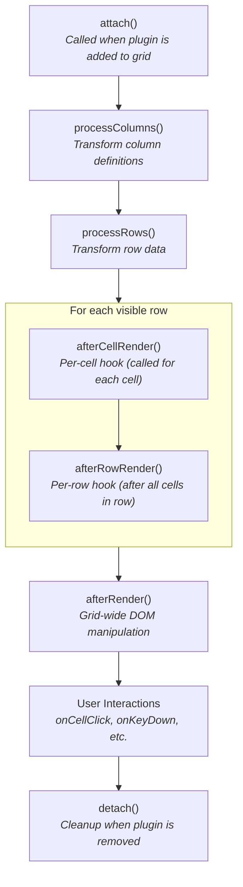

import { Tabs, TabItem, FileTree, LinkCard, CardGrid } from '@astrojs/starlight/components';


Learn how to extend `@toolbox-web/grid` with your own plugins. Plugins can add new features, modify data, inject styles, and respond to user interactions.

## Plugin Architecture

All plugins extend [`BaseGridPlugin`](/grid/api/plugin-development/classes/basegridplugin/) and implement lifecycle hooks:



## Basic Plugin Structure

A typical plugin lives in a folder under `libs/grid/src/lib/plugins/`:

<FileTree>
  - my-feature/
    - my-feature-plugin.ts — Plugin class extending [`BaseGridPlugin`](/grid/api/plugin-development/classes/basegridplugin/)
    - my-feature-plugin.spec.ts — Co-located unit tests
    - my-feature.css — Plugin styles (optional)
    - types.ts — Public config/event types (optional)
    - index.ts — Barrel export
</FileTree>

```typescript
import { BaseGridPlugin, type AfterCellRenderContext } from '@toolbox-web/grid';

// 1. Define your config interface
interface HighlightConfig {
  field: string;
  threshold: number;
  className?: string;
}

// 2. Extend BaseGridPlugin with your config type
export class HighlightPlugin extends BaseGridPlugin<HighlightConfig> {
  // Required: unique plugin name
  readonly name = 'highlight';

  // Optional: CSS styles to inject
  override readonly styles = `
    .highlight-cell {
      background: linear-gradient(135deg, #fff3cd, #ffeeba);
      font-weight: 600;
    }
  `;

  // Called for each cell during rendering
  override afterCellRender(context: AfterCellRenderContext): void {
    const { field, threshold, className = 'highlight-cell' } = this.config;
    const { column, value, cellElement } = context;

    if (column.field !== field) return;

    const numValue = typeof value === 'number' ? value : parseFloat(String(value));
    if (!isNaN(numValue) && numValue > threshold) {
      cellElement.classList.add(className);
    }
  }
}
```

## Using Your Plugin

```typescript
import { HighlightPlugin } from './highlight-plugin';

grid.gridConfig = {
  columns: [...],
  plugins: [
    new HighlightPlugin({
      field: 'salary',
      threshold: 100000,
      className: 'high-earner',
    }),
  ],
};
```

## Lifecycle Hooks

### `attach(grid)`

Called when the plugin is attached to the grid. Use for initial setup.

```typescript
override attach(grid: DataGridElement): void {
  super.attach(grid); // Always call super first!
  this.state = new Map();
  console.log('Attached to grid with', grid.rows.length, 'rows');
}
```

### `detach()`

Called when the plugin is removed. Clean up event listeners, timers, etc.

```typescript
override detach(): void {
  this.state.clear();
  clearInterval(this.timer);
  super.detach(); // Always call super last!
}
```

### `processColumns(columns)`

Transform column definitions before rendering. Return the modified array.

```typescript
override processColumns(columns: ColumnConfig[]): ColumnConfig[] {
  return [
    ...columns,
    {
      field: '__rowNumber',
      header: '#',
      width: 50,
      renderer: (ctx) => String(ctx.rowIndex + 1),
    },
  ];
}
```

### `processRows(rows)`

Transform row data before rendering. Return the modified array.

```typescript
override processRows(rows: T[]): T[] {
  return rows.filter(row => row.active);
}
```

### `afterRender()`

Called after each render cycle. Use for grid-wide DOM manipulation.

```typescript
override afterRender(): void {
  const gridEl = this.gridElement;
  const rows = gridEl.querySelectorAll('[data-row-index]');
  rows.forEach((row, i) => {
    if (i % 2 === 0) row.classList.add('even-row');
  });
}
```

### `afterCellRender(context)`

Called after each cell is rendered. More efficient than `afterRender` for per-cell modifications because you receive the cell context directly—no DOM queries needed.

```typescript
import type { AfterCellRenderContext } from '@toolbox-web/grid';

override afterCellRender(context: AfterCellRenderContext): void {
  const { row, rowIndex, colIndex, value, cellElement, column } = context;

  // Add selection class without DOM queries
  if (this.isSelected(rowIndex, colIndex)) {
    cellElement.classList.add('selected');
  }

  // Add validation error styling
  if (this.hasError(row, column.field)) {
    cellElement.classList.add('has-error');
  }
}
```

:::note[Performance]
`afterCellRender` is called for every visible cell during render and scroll. Keep implementation fast.
:::

### `afterRowRender(context)`

Called after a row is fully rendered (all cells complete). Use for row-level decorations, styling, or ARIA attributes.

```typescript
import type { AfterRowRenderContext } from '@toolbox-web/grid';

override afterRowRender(context: AfterRowRenderContext): void {
  const { row, rowIndex, rowElement } = context;

  // Add row selection class without DOM queries
  if (this.isRowSelected(rowIndex)) {
    rowElement.classList.add('selected', 'row-focus');
  }

  // Add validation error styling
  if (this.rowHasErrors(row)) {
    rowElement.classList.add('has-errors');
  }
}
```

:::note[Performance]
`afterRowRender` is called for every visible row during render and scroll. Keep implementation fast.
:::

## Built-in Plugin Helpers

[`BaseGridPlugin`](/grid/api/plugin-development/classes/basegridplugin/) provides protected helpers:

| Helper | Description |
|--------|-------------|
| `this.grid` | Typed `GridElementRef` with all plugin APIs |
| `this.gridElement` | Grid as `HTMLElement` for DOM queries |
| `this.columns` | Current column configurations |
| `this.visibleColumns` | Only visible columns |
| `this.rows` | Processed rows (after filtering, grouping) |
| `this.sourceRows` | Original unfiltered rows |
| `this.disconnectSignal` | `AbortSignal` for auto-cleanup |
| `this.isAnimationEnabled` | Whether animations are enabled |
| `this.animationDuration` | Animation duration in ms |
| `this.gridIcons` | Merged icon configuration |
| `this.getPluginByName(name)` | Get another plugin by name (preferred) |
| `this.getPlugin(PluginClass)` | Get another plugin by class |
| `this.emit(eventName, detail)` | Dispatch custom event from grid |
| `this.requestRender()` | Request full re-render |
| `this.requestAfterRender()` | Request lightweight style update |
| `this.resolveIcon(name)` | Get icon value by name |
| `this.setIcon(el, icon)` | Set icon on element |

## Event Hooks

### `onCellClick(event)`

Handle cell click events. Return `true` to prevent default behavior.

```typescript
override onCellClick(event: CustomEvent): boolean {
  const { row, field, value, cellElement } = event.detail;
  if (field === 'delete') {
    this.handleDelete(row);
    return true; // Prevent default click handling
  }
  return false; // Allow normal processing
}
```

### `onCellMouseDown(event)`

Handle mousedown for drag operations or selection.

```typescript
override onCellMouseDown(event: CustomEvent): boolean {
  const { row, field } = event.detail;

  if (field === 'drag-handle') {
    this.startDrag(row);
    return true;
  }

  return false;
}
```

### `onKeyDown(event)`

Handle keyboard events. Return `true` to prevent default.

```typescript
override onKeyDown(event: KeyboardEvent): boolean {
  if (event.ctrlKey && event.key === 'd') {
    this.duplicateSelectedRow();
    return true;
  }
  return false;
}
```

### `onScroll(event)`

Respond to scroll events (use sparingly — can impact performance).

```typescript
override onScroll(event: Event): void {
  const scrollTop = (event.target as HTMLElement).scrollTop;
  this.updateStickyElements(scrollTop);
}
```

### `renderRow(row, rowEl, rowIndex)`

Custom row rendering. Return `true` to skip default rendering.

```typescript
override renderRow(row: T, rowEl: HTMLElement, rowIndex: number): boolean {
  if (row.type === 'section-header') {
    rowEl.innerHTML = `<div class="section-header">${row.title}</div>`;
    return true;
  }
  return false;
}
```

## Injecting Styles

Plugins can inject CSS via the `styles` property (uses `adoptedStyleSheets`):

<Tabs>
  <TabItem label="External CSS File">

```typescript
// Import CSS as string (Vite)
import styles from './my-plugin.css?inline';

export class MyPlugin extends BaseGridPlugin {
  override readonly styles = styles;
}
```

```css
/* my-plugin.css */
.my-custom-class {
  background: #f0f0f0;
  border-left: 3px solid #1976d2;
}
```

  </TabItem>
  <TabItem label="Inline Styles">

```typescript
export class MyPlugin extends BaseGridPlugin {
  override readonly styles = `
    .my-custom-class {
      background: #f0f0f0;
      border-left: 3px solid #1976d2;
    }

    .my-custom-class:hover {
      background: #e0e0e0;
    }
  `;
}
```

  </TabItem>
</Tabs>

## Accessing Grid State

```typescript
override afterRender(): void {
  // Access current rows (after processing)
  const rows = this.grid.rows;

  // Access effective config
  const config = this.grid.gridConfig;

  // Access sort state
  const sortState = this.grid.sortState;

  // Access changed rows (editing)
  const changes = this.grid.changedRows;

  // Request a full re-render (internal API for plugins)
  this.grid.requestRender();

  // Request only afterRender hooks (lightweight update)
  this.grid.requestAfterRender();
}
```

## Plugin Manifest

The **Plugin Manifest** is a static property that declares metadata about your plugin's capabilities and requirements. The grid uses this metadata for:

- **Validation**: Detect missing plugins when their properties are used
- **Configuration rules**: Warn or error on invalid config combinations
- **Query routing**: Efficiently route queries only to plugins that handle them
- **Event discovery**: Document events that other plugins can subscribe to
- **Incompatibility detection**: Warn when conflicting plugins are loaded together

### Manifest Structure

```typescript
import { BaseGridPlugin, type PluginManifest } from '@toolbox-web/grid';

interface MyPluginConfig {
  optionA?: boolean;
  optionB?: boolean;
}

export class MyPlugin extends BaseGridPlugin<MyPluginConfig> {
  static override readonly manifest: PluginManifest<MyPluginConfig> = {
    // Properties this plugin owns (for validation)
    ownedProperties: [
      {
        property: 'myColumnProp',
        level: 'column',
        description: 'the "myColumnProp" column property',
      },
      {
        property: 'myGridOption',
        level: 'config',
        description: 'the "myGridOption" grid config option',
      },
    ],

    // Configuration validation rules
    configRules: [
      {
        id: 'my-plugin/invalid-combo',
        severity: 'warn',
        message: 'optionA and optionB cannot both be true',
        check: (config) => config.optionA === true && config.optionB === true,
      },
    ],

    // Queries this plugin handles
    queries: [
      { type: 'getMyState', description: 'Get the current plugin state' },
    ],

    // Events this plugin emits
    events: [
      { type: 'my-state-change', description: 'Emitted when state changes' },
    ],

    // Plugins that conflict with this one
    incompatibleWith: [
      { name: 'conflictingPlugin', reason: 'Both plugins modify the same DOM elements' },
    ],
  };

  readonly name = 'myPlugin';
}
```

### Owned Properties

Declare properties your plugin adds to [`ColumnConfig`](/grid/api/core/interfaces/columnconfig/) or [`GridConfig`](/grid/api/core/interfaces/gridconfig/). If a user configures these properties without loading your plugin, the grid throws a helpful error:

```typescript
ownedProperties: [
  {
    property: 'editable',
    level: 'column',
    description: 'the "editable" column property',
    importHint: "import { EditingPlugin } from '@toolbox-web/grid/plugins/editing';",
  },
],
```

Error shown to user:

```
[tbw-grid] Configuration error:
Column(s) [name, email] use the "editable" column property, but the required plugin is not loaded.
  → Add the plugin to your gridConfig.plugins array:
    import { EditingPlugin } from '@toolbox-web/grid/plugins/editing';
    plugins: [new EditingPlugin(), ...]
```

### Configuration Rules

```typescript
configRules: [
  {
    id: 'selection/range-dblclick',
    severity: 'warn',
    message: '"triggerOn: dblclick" has no effect when mode is "range".',
    check: (config) => config.mode === 'range' && config.triggerOn === 'dblclick',
  },
],
```

- `severity: 'error'` — Throws an exception (always)
- `severity: 'warn'` — Logs to console (development only)

### Plugin Dependencies

Declare required plugins via a static `dependencies` property:

```typescript
export class UndoRedoPlugin extends BaseGridPlugin<UndoRedoConfig> {
  static override readonly dependencies: PluginDependency[] = [
    { name: 'editing', required: true, reason: 'Tracks cell edit history' },
    { name: 'selection', required: false, reason: 'Enables selection-based undo' },
  ];

  readonly name = 'undoRedo';
}
```

:::danger
Dependencies must be loaded *before* the dependent plugin. Wrong order **throws a runtime error**:

```typescript
// ✅ Correct order
plugins: [new EditingPlugin(), new UndoRedoPlugin()]

// ❌ Wrong order — throws error
plugins: [new UndoRedoPlugin(), new EditingPlugin()]
```
:::

## Plugin Communication

### Event Bus (Plugin-to-Plugin)

Plugins can emit and subscribe to events using the built-in Event Bus. Events are automatically cleaned up when a plugin is detached.

```typescript
import { BaseGridPlugin, type PluginManifest } from '@toolbox-web/grid';

// Plugin A: Emit events
export class FilterPlugin extends BaseGridPlugin<FilterConfig> {
  readonly name = 'filtering';

  // Declare events in manifest for discoverability
  static override readonly manifest: PluginManifest = {
    events: [
      { type: 'filter-applied', description: 'Emitted when filters change' },
    ],
  };

  applyFilter(criteria: FilterCriteria): void {
    // ... filter logic

    // Emit to other plugins (NOT a DOM event)
    this.emitPluginEvent('filter-applied', { criteria, rowCount: this.rows.length });
  }
}

// Plugin B: Subscribe to events
export class SelectionPlugin extends BaseGridPlugin<SelectionConfig> {
  readonly name = 'selection';

  override attach(grid: GridElement): void {
    super.attach(grid);

    // Subscribe — auto-cleaned on detach
    this.on('filter-applied', (detail) => {
      console.log('Filter changed, clearing selection');
      this.clearSelection();
    });
  }
}
```

### Query System (Synchronous State Retrieval)

Plugins can expose queryable state that other plugins can retrieve synchronously.

```typescript
import { BaseGridPlugin, type PluginManifest, type PluginQuery } from '@toolbox-web/grid';

// Plugin A: Handle queries
export class SelectionPlugin extends BaseGridPlugin<SelectionConfig> {
  readonly name = 'selection';

  // Declare queries in manifest for routing
  static override readonly manifest: PluginManifest = {
    queries: [
      { type: 'getSelection', description: 'Get current selection state' },
    ],
  };

  override handleQuery(query: PluginQuery): unknown {
    if (query.type === 'getSelection') {
      return this.getSelection();
    }
    return undefined;
  }
}

// Plugin B: Query other plugins
export class ClipboardPlugin extends BaseGridPlugin<ClipboardConfig> {
  readonly name = 'clipboard';

  copy(): void {
    const responses = this.grid.query<SelectionResult>('getSelection', undefined);
    const selection = responses[0];
    if (selection?.ranges.length > 0) {
      // Copy selected cells
    }
  }
}
```

### DOM Events (External Consumers)

For events that external code should listen to, use `emit()`:

```typescript
this.emit('copy', { text: copiedText, rowCount: 5 });

// External code:
grid.addEventListener('copy', (e) => console.log(e.detail));
```

## TypeScript Generics

For type-safe row access, use generics:

```typescript
export class TypedPlugin<T extends { id: number }> extends BaseGridPlugin<{ idField: keyof T }> {
  override processRows(rows: T[]): T[] {
    const idField = this.config.idField;
    return rows.filter(row => row[idField] != null);
  }
}

// Usage
new TypedPlugin<Employee>({ idField: 'employeeId' });
```

## Complete Example: Row Numbering Plugin

This example adds a synthetic column that doesn't map to any field in the data. The `__rowNumber` field doesn't exist on row objects—the renderer uses `ctx.rowIndex` instead of `ctx.value`. This pattern is safe because:

- `processColumns` only modifies column definitions, not row data
- Renderers produce DOM output—they don't write back to the source data
- The `rows` array remains unchanged

```typescript
import { BaseGridPlugin, type ColumnConfig } from '@toolbox-web/grid';

interface RowNumberConfig {
  header?: string;
  width?: number;
  startFrom?: number;
}

export class RowNumberPlugin extends BaseGridPlugin<RowNumberConfig> {
  readonly name = 'rowNumber';

  override readonly styles = `
    .row-number-cell {
      color: #888;
      font-size: 0.85em;
      text-align: center;
    }
  `;

  override processColumns(columns: ColumnConfig[]): ColumnConfig[] {
    const { header = '#', width = 50, startFrom = 1 } = this.config;

    return [
      {
        field: '__rowNumber',
        header,
        width,
        minWidth: 40,
        maxWidth: 80,
        resizable: false,
        sortable: false,
        renderer: (ctx) => {
          const span = document.createElement('span');
          span.className = 'row-number-cell';
          span.textContent = String(ctx.rowIndex + startFrom);
          return span;
        },
      },
      ...columns,
    ];
  }
}
```

## Best Practices

1. **Always call `super`** — In `attach()` call it first, in `detach()` call it last
2. **Use unique names** — Plugin `name` should be unique across all plugins
3. **Clean up resources** — Remove event listeners and timers in `detach()`
4. **Return modified data** — `processColumns` and `processRows` must return arrays
5. **Use `ctx.signal`** — For automatic cleanup of event listeners in renderers
6. **Avoid heavy operations** — Keep hooks fast, especially `onScroll` and `afterRender`
7. **Document your config** — Use JSDoc comments for IDE support
8. **Version your plugins** — Increment version when making breaking changes

## Testing Plugins

```typescript
import { describe, it, expect, beforeEach } from 'vitest';
import { RowNumberPlugin } from './row-number-plugin';

describe('RowNumberPlugin', () => {
  let plugin: RowNumberPlugin;

  beforeEach(() => {
    plugin = new RowNumberPlugin({ startFrom: 1 });
  });

  it('should add row number column', () => {
    const columns = plugin.processColumns([
      { field: 'name', header: 'Name' },
    ]);

    expect(columns).toHaveLength(2);
    expect(columns[0].field).toBe('__rowNumber');
  });
});
```

## See Also

<CardGrid>
  <LinkCard title="Plugins Overview" description="Built-in plugin catalog with dependencies and import paths" href="/grid/plugins/" />
  <LinkCard title="Architecture" description="How plugins fit into the grid's rendering pipeline" href="/grid/architecture/" />
  <LinkCard title="Events Reference" description="Complete list of all grid and plugin events" href="/grid/events/" />
  <LinkCard title="API Reference" description="getPluginByName(), getPlugin(), and plugin access methods" href="/grid/api-reference/" />
</CardGrid>
