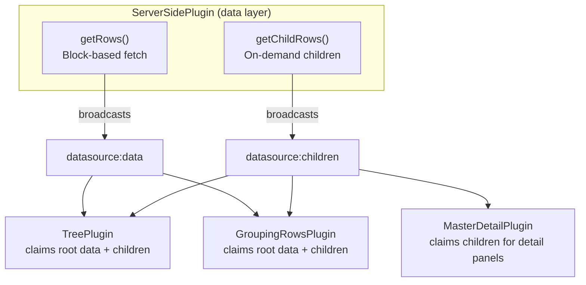

import { TabItem, Tabs } from '@astrojs/starlight/components';

The grid's **server-side data architecture** lets you load data from remote APIs with virtual scrolling, on-demand child loading, and automatic caching. It's built on a unified **DataSource event bus** that decouples data fetching from data rendering — plugins that *display* data (Tree, Row Grouping, Master-Detail) compose seamlessly with `ServerSidePlugin`, which *fetches* data.

## Architecture Overview



**Key concepts:**
- **Node-space pagination**: `getRows()` fetches data in blocks using `startNode`/`endNode`. A "node" is one atomic pagination unit — a top-level tree node, a group definition, or a flat row.
- **Structural plugins claim data**: When `datasource:data` fires, exactly one structural plugin (Tree or Row Grouping) *claims* the data by setting `detail.claimed = true`. If no plugin claims it, ServerSidePlugin renders the rows directly (flat data mode).
- **On-demand children**: When a user expands a tree node, group, or detail row, the display plugin fires a `datasource:fetch-children` query. ServerSidePlugin calls `getChildRows()` and broadcasts the result as `datasource:children` with a `source` discriminator so only the requesting plugin consumes it.
- **Child rows are not paginated**: `getChildRows()` returns all children in a single batch. If the server has a large child set, limit it server-side.

## DataSource Interface

The unified `ServerSideDataSource` interface provides two methods:

```typescript
import type { ServerSideDataSource } from '@toolbox-web/grid/plugins/server-side';

const dataSource: ServerSideDataSource = {
  // Required: fetch root-level rows by block
  async getRows(params) {
    // params: { startNode, endNode, sortModel, filterModel }
    const res = await fetch(`/api/data?start=${params.startNode}&end=${params.endNode}`);
    const data = await res.json();
    return { rows: data.items, totalNodeCount: data.total };
  },

  // Optional: fetch children for tree nodes, groups, or detail panels
  async getChildRows(params) {
    // params.context: { source: 'tree' | 'grouping-rows' | 'master-detail', ...pluginData }
    const { source } = params.context;

    if (source === 'tree') {
      const { parentNode } = params.context;
      const res = await fetch(`/api/tree/${parentNode.id}/children`);
      return { rows: await res.json() };
    }

    if (source === 'grouping-rows') {
      const { groupKey } = params.context;
      const res = await fetch(`/api/groups/${groupKey}/rows`);
      return { rows: await res.json() };
    }

    if (source === 'master-detail') {
      const { row } = params.context;
      const res = await fetch(`/api/orders/${row.id}/items`);
      return { rows: await res.json() };
    }

    return { rows: [] };
  },
};
```

## Plugin Compositions

### ServerSide + Tree

ServerSidePlugin fetches top-level tree nodes in blocks. Expand/collapse is handled locally by TreePlugin for nodes whose children are embedded. For lazy children loading, TreePlugin fires `datasource:fetch-children` with `source: 'tree'`.

```typescript
import '@toolbox-web/grid/features/server-side';
import '@toolbox-web/grid/features/tree';

grid.gridConfig = {
  columns: [...],
  features: {
    serverSide: { pageSize: 50 },
    tree: { childrenField: 'children' },
  },
};

grid.ready().then(() => {
  grid.getPluginByName('serverSide').setDataSource({
    async getRows(params) {
      const res = await fetch(`/api/tree?start=${params.startNode}&end=${params.endNode}`);
      const data = await res.json();
      return { rows: data.nodes, totalNodeCount: data.total };
    },
    // Optional: fetch children lazily instead of embedding them
    async getChildRows(params) {
      const { parentNode } = params.context;
      const res = await fetch(`/api/tree/${parentNode.id}/children`);
      return { rows: await res.json() };
    },
  });
});
```

**Data flow:**
1. ServerSide fetches block → broadcasts `datasource:data`
2. TreePlugin claims data and flattens the hierarchy
3. On node expand → TreePlugin queries `datasource:fetch-children`
4. ServerSide calls `getChildRows()` → broadcasts `datasource:children`
5. TreePlugin receives children and re-renders

See the [Tree plugin docs](/grid/plugins/tree/#server-side-data) for full details.

### ServerSide + Row Grouping

ServerSidePlugin fetches group definitions as the root data. When a group is expanded, GroupingRowsPlugin fires `datasource:fetch-children` to load the group's rows.

```typescript
import '@toolbox-web/grid/features/server-side';
import '@toolbox-web/grid/features/grouping-rows';

grid.gridConfig = {
  columns: [...],
  features: {
    serverSide: { pageSize: 50 },
    groupingRows: true,
  },
};

grid.ready().then(() => {
  grid.getPluginByName('serverSide').setDataSource({
    async getRows(params) {
      // Return group definitions as root nodes
      const res = await fetch(`/api/groups?start=${params.startNode}&end=${params.endNode}`);
      const data = await res.json();
      return { rows: data.groups, totalNodeCount: data.total };
    },
    async getChildRows(params) {
      const { groupKey } = params.context;
      const res = await fetch(`/api/groups/${groupKey}/rows`);
      return { rows: await res.json() };
    },
  });
});
```

**Data flow:**
1. ServerSide fetches block → broadcasts `datasource:data`
2. GroupingRowsPlugin claims data as pre-defined groups
3. On group expand → GroupingRowsPlugin queries `datasource:fetch-children`
4. ServerSide calls `getChildRows()` → broadcasts `datasource:children`
5. GroupingRowsPlugin receives rows and renders them under the group

See the [Row Grouping plugin docs](/grid/plugins/grouping-rows/#server-side-data) for full details.

### ServerSide + Master-Detail

ServerSidePlugin fetches flat rows. When a detail panel is expanded, MasterDetailPlugin fires `datasource:fetch-children` to load the detail data.

```typescript
import '@toolbox-web/grid/features/server-side';
import '@toolbox-web/grid/features/master-detail';

grid.gridConfig = {
  columns: [...],
  features: {
    serverSide: { pageSize: 50 },
    masterDetail: {
      detailRenderer: (row, rowIndex) => {
        const plugin = grid.getPluginByName('masterDetail');
        const data = plugin.getDetailData(rowIndex);
        if (!data) return '<div class="loading">Loading…</div>';
        return `<ul>${data.map((item: any) => `<li>${item.name}</li>`).join('')}</ul>`;
      },
    },
  },
};

grid.ready().then(() => {
  grid.getPluginByName('serverSide').setDataSource({
    async getRows(params) {
      const res = await fetch(`/api/orders?start=${params.startNode}&end=${params.endNode}`);
      const data = await res.json();
      return { rows: data.orders, totalNodeCount: data.total };
    },
    async getChildRows(params) {
      const { row } = params.context;
      const res = await fetch(`/api/orders/${row.id}/items`);
      return { rows: await res.json() };
    },
  });
});
```

**Data flow:**
1. ServerSide fetches rows → renders normally (no structural claim)
2. On detail expand → MasterDetailPlugin queries `datasource:fetch-children`
3. ServerSide calls `getChildRows()` → broadcasts `datasource:children`
4. MasterDetailPlugin stores data → re-renders detail panel
5. `detailRenderer` uses `getDetailData(rowIndex)` to access async data

See the [Master-Detail plugin docs](/grid/plugins/master-detail/#server-side-data) for full details.

## Event Bus Reference

| Event / Query | Direction | Description |
| --- | --- | --- |
| `datasource:data` | ServerSide → plugins | Root data block loaded. Structural plugins claim it |
| `datasource:children` | ServerSide → plugins | Child data loaded. Filtered by `context.source` |
| `datasource:loading` | ServerSide → plugins | Loading state changed (with optional context) |
| `datasource:error` | ServerSide → plugins | Fetch failed (with optional context) |
| `datasource:fetch-children` | Plugins → ServerSide | Query requesting child rows for a context |
| `datasource:is-active` | Plugins → ServerSide | Query checking if a data source is configured |
| `datasource:viewport-mapping` | ServerSide → plugins | Query mapping viewport indices to node-space indices |

## Diagnostic Codes

| Code | Level | Description |
| --- | --- | --- |
| `TBW140` | error | `getRows()` fetch failed |
| `TBW141` | error | `getChildRows()` fetch failed |
| `TBW142` | warn | Plugin requested children but `getChildRows()` is not implemented |
| `TBW143` | warn | `datasource:data` was not claimed by any structural plugin |

## Limitations

- **Child rows are not paginated.** `getChildRows()` returns all children in a single batch. For tree nodes, group rows, or detail data with many children, limit the response server-side.
- **One structural claim per data event.** Only one of Tree or Row Grouping can claim `datasource:data`. They remain mutually incompatible.
- **Master-Detail does not claim root data.** It only uses the child data path (`datasource:fetch-children` / `datasource:children`).

## See Also

- **[Server-Side Plugin](/grid/plugins/server-side/)** — Plugin configuration, caching, Virtual scroll and paging modes
- **[Tree Plugin — Server-Side Data](/grid/plugins/tree/#server-side-data)** — Tree-specific data flow
- **[Row Grouping — Server-Side Data](/grid/plugins/grouping-rows/#server-side-data)** — Group-specific data flow
- **[Master-Detail — Server-Side Data](/grid/plugins/master-detail/#server-side-data)** — Detail panel data flow
- **[Common Patterns](/grid/guides/common-patterns/)** — Full application recipes
