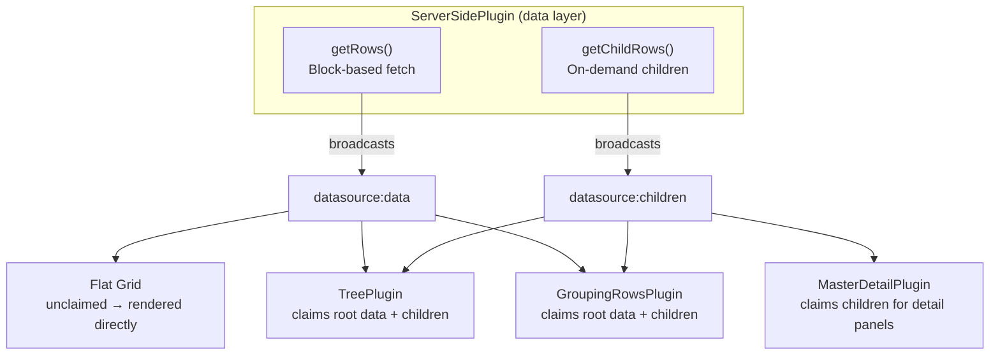

import { TabItem, Tabs } from '@astrojs/starlight/components';
import ServerSideDemo from '@components/demos/server-side/ServerSideDemo.astro';
import ShowSource from '@components/ShowSource.astro';


The Server-Side plugin enables **virtual scrolling with lazy loading** from a remote API. It's designed for large datasets (10,000+ rows) where loading all data upfront would be impractical or slow.

## When to Use This Plugin

| Scenario | Recommended Approach |
|----------|---------------------|
| < 1,000 rows | Load all data upfront (no plugin needed) |
| 1,000 - 10,000 rows | Consider based on network speed and data complexity |
| 10,000+ rows | **Use ServerSidePlugin** |
| Infinite scroll / pagination | **Use ServerSidePlugin** |
| Data changes frequently on server | **Use ServerSidePlugin** with `refresh()` |

## Key Features

- **Block-based fetching**: Loads only visible rows plus a buffer
- **LRU caching**: Keeps recently viewed blocks in memory
- **Automatic prefetching**: Loads next blocks as user scrolls
- **Concurrent request limiting**: Prevents overwhelming the server
- **Loading placeholders**: Shows loading state for pending rows
- **Integration with sorting/filtering**: Works with `sortHandler` and `filterHandler`

## Installation

```ts
import '@toolbox-web/grid/features/server-side';
```

## Basic Usage

The feature requires a **data source** that implements the `getRows` method. Pass it directly in the config via `dataSource`:

<Tabs syncKey="framework">
  <TabItem label="TypeScript">
```ts
import { queryGrid } from '@toolbox-web/grid';
import '@toolbox-web/grid/features/server-side';
import type { GetRowsParams, ServerSideDataSource } from '@toolbox-web/grid/plugins/server-side';

const dataSource: ServerSideDataSource = {
  async getRows(params: GetRowsParams) {
    // params: { startNode, endNode, sortModel, filterModel }
    const response = await fetch(`/api/data?start=${params.startNode}&end=${params.endNode}`);
    const data = await response.json();
    return {
      rows: data.rows,
      totalNodeCount: data.total, // Required for scroll height calculation
    };
  },
};

const grid = queryGrid('tbw-grid');
grid.gridConfig = {
  columns: [
    { field: 'id', header: 'ID' },
    { field: 'name', header: 'Name' },
    { field: 'email', header: 'Email' },
  ],
  features: {
    serverSide: {
      pageSize: 50,
      dataSource,
    },
  },
};
```
  </TabItem>
  <TabItem label="React">
```tsx
import '@toolbox-web/grid-react/features/server-side';
import { DataGrid } from '@toolbox-web/grid-react';
import type { GetRowsParams, ServerSideDataSource } from '@toolbox-web/grid/plugins/server-side';

const dataSource: ServerSideDataSource = {
  async getRows(params: GetRowsParams) {
    const response = await fetch(`/api/data?start=${params.startNode}&end=${params.endNode}`);
    const data = await response.json();
    return { rows: data.rows, totalNodeCount: data.total };
  },
};

function ServerSideGrid() {
  return (
    <DataGrid
      columns={[
        { field: 'id', header: 'ID' },
        { field: 'name', header: 'Name' },
        { field: 'email', header: 'Email' },
      ]}
      serverSide={{ pageSize: 50, dataSource }}
      style={{ height: '400px' }}
    />
  );
}
```
  </TabItem>
  <TabItem label="Vue">
```html
<script setup lang="ts">
import '@toolbox-web/grid-vue/features/server-side';
import { TbwGrid, TbwGridColumn } from '@toolbox-web/grid-vue';
import type { GetRowsParams, ServerSideDataSource } from '@toolbox-web/grid/plugins/server-side';

const dataSource: ServerSideDataSource = {
  async getRows(params: GetRowsParams) {
    const response = await fetch(`/api/data?start=${params.startNode}&end=${params.endNode}`);
    const data = await response.json();
    return { rows: data.rows, totalNodeCount: data.total };
  },
};

const serverSideConfig = {
  pageSize: 50,
  dataSource,
};
</script>

<template>
  <TbwGrid :server-side="serverSideConfig" style="height: 400px">
    <TbwGridColumn field="id" header="ID" />
    <TbwGridColumn field="name" header="Name" />
    <TbwGridColumn field="email" header="Email" />
  </TbwGrid>
</template>
```
  </TabItem>
  <TabItem label="Angular">
```typescript
// Feature import - enables the [serverSide] input
import '@toolbox-web/grid-angular/features/server-side';

import { Component } from '@angular/core';
import { Grid } from '@toolbox-web/grid-angular';
import type { ColumnConfig } from '@toolbox-web/grid';
import type { GetRowsParams, ServerSideDataSource } from '@toolbox-web/grid/plugins/server-side';

@Component({
  selector: 'app-server-side-grid',
  imports: [Grid],
  template: `
    <tbw-grid
      [columns]="columns"
      [serverSide]="serverSideConfig"
      style="height: 400px; display: block;">
    </tbw-grid>
  `,
})
export class ServerSideGridComponent {
  columns: ColumnConfig[] = [
    { field: 'id', header: 'ID' },
    { field: 'name', header: 'Name' },
    { field: 'email', header: 'Email' },
  ];

  dataSource: ServerSideDataSource = {
    getRows: async (params: GetRowsParams) => {
      const response = await fetch(`/api/data?start=${params.startNode}&end=${params.endNode}`);
      const data = await response.json();
      return { rows: data.rows, totalNodeCount: data.total };
    },
  };

  serverSideConfig = {
    pageSize: 50,
    dataSource: this.dataSource,
  };
}
```
  </TabItem>
</Tabs>

## Demo

Toggle between virtual scrolling and paging mode, adjust the page size, and enable server-side sorting — all in one demo.

<ShowSource file="demos/server-side/ServerSideDemo.astro">
  <ServerSideDemo />
</ShowSource>

### Server-Side Sorting & Filtering

The plugin handles sorting and filtering natively: when the user clicks a sortable header or applies a column filter, the cache is purged and `getRows()` is called again with `sortModel` and `filterModel` populated. Your handler decides how to translate those into the request:

```ts
async getRows(params: GetRowsParams) {
  const url = new URL('/api/data', location.origin);
  url.searchParams.set('start', String(params.startNode));
  url.searchParams.set('end', String(params.endNode));
  if (params.sortModel?.length) {
    url.searchParams.set('sort', params.sortModel[0].field);
    url.searchParams.set('dir', params.sortModel[0].direction);
  }
  if (params.filterModel) {
    url.searchParams.set('filter', JSON.stringify(params.filterModel));
  }
  const res = await fetch(url);
  return res.json();
}
```

Toggle **Server-side sorting** / **Server-side filtering** in the demo above to see the request parameters change. Toggling them off switches to [local mode](#local-sort--filter-modes) — the plugin keeps the loaded blocks and sorts/filters them in the browser without a refetch.

:::note[Standalone handlers]
The grid also exposes [`sortHandler`](/grid/plugins/multi-sort/#server-side-sorting) (core `GridConfig`) and [`filterHandler` / `valuesHandler`](/grid/plugins/filtering/#async-filtering-server-side) (FilteringPlugin config). These are **independent** of the ServerSidePlugin and let you offload sort/filter work to the server **without** opting into block-based virtual scrolling. Use them when you want async sort/filter against an already-loaded dataset; use ServerSidePlugin's native `sortModel`/`filterModel` when you want them combined with lazy block loading.
:::

### Local Sort / Filter Modes

By default, the ServerSidePlugin treats every sort or filter change as a model change: it purges the cache and refetches all visible blocks. This is correct when the backend owns ordering and filtering, but if you want to sort or filter the **already-loaded** rows in the browser without a roundtrip, set the corresponding mode to `'local'`:

```ts
serverSide: {
  dataSource,
  sortMode: 'local',   // re-sort cached rows in place; no refetch
  filterMode: 'local', // re-filter cached rows in place; no refetch
}
```

When a mode is `'local'`:

- The plugin no longer refetches on `sort-change` / `filter-change` — it just requests a re-render.
- The corresponding `sortModel` / `filterModel` is **omitted** from `GetRowsParams` so scroll-triggered block fetches don't leak local state to the backend.
- Already-loading placeholder rows are pinned to the end of the sort order so the in-progress fetch stays visually grouped.

| Use case                                      | `sortMode` | `filterMode` |
| --------------------------------------------- | ---------- | ------------ |
| Backend owns sort + filter (default)          | `'server'` | `'server'`   |
| Backend filters; user re-sorts on screen      | `'local'`  | `'server'`   |
| Backend pre-sorts; user filters on screen     | `'server'` | `'local'`    |
| All processing on already-loaded page         | `'local'`  | `'local'`    |

:::caution
Local filtering only filters rows currently in the cache. With virtual scrolling enabled, that's the visible window plus any prefetched blocks — not the full dataset. Use `'local'` filtering only when the loaded subset is meaningful on its own (for example, paged mode).
:::

:::note
A column with a custom `sortComparator` is treated as user-owned: loading placeholder rows are **not** auto-pinned. Pin them yourself in your comparator if you want the same behaviour.
:::

### Prefetching with `loadThreshold`

By default the plugin only fetches a block when the **visible viewport** enters it. On gentle scrolling this means users see placeholder rows for the duration of the network round-trip. Set `loadThreshold` to prefetch the next block(s) before the user scrolls into them:

```ts
serverSide: {
  dataSource,
  pageSize: 100,
  loadThreshold: 50, // start fetching the next block when within 50 rows of it
}
```

The threshold is applied symmetrically (the viewport is expanded by `loadThreshold` rows in both directions before block coverage is computed). The `maxConcurrentRequests` cap and per-block dedup still apply, so a large threshold during fast scrolling will not flood the server.

A reasonable starting point is `pageSize / 2`. Values larger than `cacheBlockSize` will eagerly request 2+ blocks ahead, which can hurt perceived performance with slow backends.

## Configuration Options

See [`ServerSideConfig`](./Interfaces/ServerSideConfig/) for the full list of options and defaults.

## TypeScript Interfaces

- [`ServerSideDataSource`](./Interfaces/ServerSideDataSource/) — Data source contract with `getRows()` and optional `getChildRows()`
- [`GetRowsParams`](./Interfaces/GetRowsParams/) — Parameters passed to `getRows()` (startNode, endNode, sortModel, filterModel)
- [`GetRowsResult`](./Interfaces/GetRowsResult/) — Return type with `rows` and `totalNodeCount`
- [`GetChildRowsParams`](./Interfaces/GetChildRowsParams/) — Parameters for `getChildRows()` with plugin context
- [`GetChildRowsResult`](./Interfaces/GetChildRowsResult/) — Return type with `rows`

## Programmatic API

```ts
const plugin = grid.getPluginByName('serverSide');

plugin.setDataSource(newDataSource);  // Replace the data source at runtime
plugin.refresh();                      // Reload current viewport from server
plugin.purgeCache();                   // Clear all cached blocks
plugin.getTotalNodeCount();            // Get server-reported total node count
plugin.isNodeLoaded(index);            // Check if a specific node is in cache
plugin.getLoadedBlockCount();          // Number of blocks currently cached
```

:::tip
For most use cases, pass `dataSource` directly in the config — no need for `setDataSource()`. Use `setDataSource()` only when you need to **swap** the data source at runtime (e.g., switching API endpoints based on user action).
:::

## Architecture: How It Works

The plugin uses a **block-based caching strategy**:

```
┌────────────────────────────────────────────────┐
│  Total Dataset: 100,000 rows (on server)       │
├────────────────────────────────────────────────┤
│  Block 0: rows 0-99     [CACHED]               │
│  Block 1: rows 100-199  [CACHED]               │
│  Block 2: rows 200-299  [LOADING...]           │
│  Block 3: rows 300-399  [NOT LOADED]           │
│  ...                                           │
│  Block 999: rows 99900-99999 [NOT LOADED]      │
└────────────────────────────────────────────────┘
```

**Scroll triggers:**
1. `onScroll` event fires
2. Plugin calculates which blocks are needed for the visible viewport
3. Missing blocks are requested from the data source
4. `requestRender()` is called when data arrives
5. Grid re-renders with new data

**Loading state:**
Rows that haven't loaded yet are represented with placeholder objects:
```ts
{ __loading: true, __index: 42 }
```

You can detect loading rows via a custom cell renderer and style them accordingly:
```ts
columns: [{
  field: 'name',
  renderer: (value, row) => row.__loading ? '<span class="loading">Loading…</span>' : value,
}]
```

## Live Data Updates (WebSocket/SSE)

The grid's **Transaction API** lets you push real-time updates from any streaming source — WebSocket, Server-Sent Events, polling, or any other transport — into the grid efficiently.

The grid deliberately does **not** manage transport connections. Your application owns the WebSocket/SSE lifecycle (authentication, reconnection, backoff), and the grid provides the efficient mutation primitives to apply incoming changes.

### WebSocket Example

<Tabs syncKey="framework">
  <TabItem label="TypeScript">
```ts
import { queryGrid } from '@toolbox-web/grid';
import '@toolbox-web/grid/features/server-side';
import type { RowTransaction } from '@toolbox-web/grid';
import type { GetRowsParams, ServerSideDataSource } from '@toolbox-web/grid/plugins/server-side';

interface Employee {
  id: string;
  name: string;
  status: string;
}

const dataSource: ServerSideDataSource<Employee> = {
  async getRows(params: GetRowsParams) {
    const res = await fetch(`/api/employees?start=${params.startNode}&end=${params.endNode}`);
    return res.json();
  },
};

const grid = queryGrid<Employee>('tbw-grid');
grid.gridConfig = {
  columns: [
    { field: 'id', header: 'ID' },
    { field: 'name', header: 'Name' },
    { field: 'status', header: 'Status' },
  ],
  features: {
    serverSide: {
      pageSize: 50,
      dataSource,
    },
  },
};

// Connect WebSocket for live updates
const ws = new WebSocket('wss://api.example.com/employees/live');

ws.onmessage = (event) => {
  const msg = JSON.parse(event.data);

  const tx: RowTransaction<Employee> = {};
  switch (msg.type) {
    case 'insert':
      tx.add = [msg.row];
      break;
    case 'update':
      tx.update = [{ id: msg.rowId, changes: msg.changes }];
      break;
    case 'delete':
      tx.remove = [{ id: msg.rowId }];
      break;
  }

  grid.applyTransaction(tx);
};
```
  </TabItem>
  <TabItem label="React">
```tsx
import '@toolbox-web/grid-react/features/server-side';
import { DataGrid, useGrid } from '@toolbox-web/grid-react';
import type { RowTransaction } from '@toolbox-web/grid';
import type { GetRowsParams, ServerSideDataSource } from '@toolbox-web/grid/plugins/server-side';
import { useEffect } from 'react';

interface Employee {
  id: string;
  name: string;
  status: string;
}

const dataSource: ServerSideDataSource<Employee> = {
  async getRows(params: GetRowsParams) {
    const res = await fetch(`/api/employees?start=${params.startNode}&end=${params.endNode}`);
    return res.json();
  },
};

function LiveGrid() {
  const { ref, element } = useGrid<Employee>();

  // Connect WebSocket for live updates
  useEffect(() => {
    if (!element) return;
    const ws = new WebSocket('wss://api.example.com/employees/live');

    ws.onmessage = (event) => {
      const msg = JSON.parse(event.data);
      const tx: RowTransaction<Employee> = {};
      if (msg.type === 'insert') tx.add = [msg.row];
      if (msg.type === 'update') tx.update = [{ id: msg.rowId, changes: msg.changes }];
      if (msg.type === 'delete') tx.remove = [{ id: msg.rowId }];
      element.applyTransaction(tx);
    };

    return () => ws.close();
  }, [element]);

  return (
    <DataGrid
      ref={ref}
      columns={[
        { field: 'id', header: 'ID' },
        { field: 'name', header: 'Name' },
        { field: 'status', header: 'Status' },
      ]}
      serverSide={{ pageSize: 50, dataSource }}
      style={{ height: '400px' }}
    />
  );
}
```
  </TabItem>
  <TabItem label="Vue">
```html
<script setup lang="ts">
import '@toolbox-web/grid-vue/features/server-side';
import { TbwGrid, TbwGridColumn, useGrid } from '@toolbox-web/grid-vue';
import type { RowTransaction } from '@toolbox-web/grid';
import type { GetRowsParams, ServerSideDataSource } from '@toolbox-web/grid/plugins/server-side';
import { watch, onUnmounted } from 'vue';

interface Employee {
  id: string;
  name: string;
  status: string;
}

const dataSource: ServerSideDataSource<Employee> = {
  async getRows(params: GetRowsParams) {
    const res = await fetch(`/api/employees?start=${params.startNode}&end=${params.endNode}`);
    return res.json();
  },
};

const serverSideConfig = {
  pageSize: 50,
  dataSource,
};

const { gridElement, isReady } = useGrid<Employee>();
let ws: WebSocket | null = null;

watch(isReady, (ready) => {
  if (!ready) return;
  const grid = gridElement.value;

  ws = new WebSocket('wss://api.example.com/employees/live');
  ws.onmessage = (event) => {
    const msg = JSON.parse(event.data);
    const tx: RowTransaction<Employee> = {};
    if (msg.type === 'insert') tx.add = [msg.row];
    if (msg.type === 'update') tx.update = [{ id: msg.rowId, changes: msg.changes }];
    if (msg.type === 'delete') tx.remove = [{ id: msg.rowId }];
    grid?.applyTransaction(tx);
  };
});

onUnmounted(() => ws?.close());
</script>

<template>
  <TbwGrid :server-side="serverSideConfig" style="height: 400px">
    <TbwGridColumn field="id" header="ID" />
    <TbwGridColumn field="name" header="Name" />
    <TbwGridColumn field="status" header="Status" />
  </TbwGrid>
</template>
```
  </TabItem>
  <TabItem label="Angular">
```typescript
import '@toolbox-web/grid-angular/features/server-side';
import { Component, effect, OnDestroy } from '@angular/core';
import { Grid, injectGrid } from '@toolbox-web/grid-angular';
import type { ColumnConfig, RowTransaction } from '@toolbox-web/grid';
import type { GetRowsParams, ServerSideDataSource } from '@toolbox-web/grid/plugins/server-side';

interface Employee {
  id: string;
  name: string;
  status: string;
}

@Component({
  selector: 'app-live-grid',
  imports: [Grid],
  template: `
    <tbw-grid
      [columns]="columns"
      [serverSide]="serverSideConfig"
      style="height: 400px; display: block;">
    </tbw-grid>
  `,
})
export class LiveGridComponent implements OnDestroy {
  grid = injectGrid<Employee>();
  columns: ColumnConfig[] = [
    { field: 'id', header: 'ID' },
    { field: 'name', header: 'Name' },
    { field: 'status', header: 'Status' },
  ];

  dataSource: ServerSideDataSource<Employee> = {
    async getRows(params: GetRowsParams) {
      const res = await fetch(`/api/employees?start=${params.startNode}&end=${params.endNode}`);
      return res.json();
    },
  };

  serverSideConfig = {
    pageSize: 50,
    dataSource: this.dataSource,
  };

  private ws: WebSocket | null = null;

  constructor() {
    effect(() => {
      const el = this.grid.element();
      if (!el) return;

      this.ws = new WebSocket('wss://api.example.com/employees/live');
      this.ws.onmessage = (event) => {
        const msg = JSON.parse(event.data);
        const tx: RowTransaction<Employee> = {};
        if (msg.type === 'insert') tx.add = [msg.row];
        if (msg.type === 'update') tx.update = [{ id: msg.rowId, changes: msg.changes }];
        if (msg.type === 'delete') tx.remove = [{ id: msg.rowId }];
        el.applyTransaction(tx);
      };
    });
  }

  ngOnDestroy() {
    this.ws?.close();
  }
}
```
  </TabItem>
</Tabs>

### High-Frequency Streams

For data feeds with many updates per second (e.g. financial tickers, IoT sensors), use `applyTransactionAsync()` to automatically batch all updates arriving within a single animation frame:

```ts
// All messages within one frame are merged into a single render
ws.onmessage = (event) => {
  const msg = JSON.parse(event.data);
  grid.applyTransactionAsync({
    update: [{ id: msg.id, changes: msg.changes }],
  });
};
```

### Choosing the Right Method

| Scenario | Method | Animations |
|----------|--------|------------|
| User actions, moderate streams (< 10 msg/s) | `applyTransaction()` | Yes (configurable) |
| High-frequency ticker (100+ msg/s) | `applyTransactionAsync()` | Disabled (batched) |
| Bulk initial load from REST, then switch to streaming | `setDataSource()` + `applyTransaction()` | Mixed |

:::tip
Both methods return a `TransactionResult` with the actual `added`, `updated`, and `removed` row objects — useful for logging, analytics, or triggering side effects.
:::

### Server-Sent Events (SSE)

SSE works the same way — just swap the transport:

```ts
const source = new EventSource('/api/employees/stream');

source.addEventListener('insert', (e) => {
  grid.applyTransaction({ add: [JSON.parse(e.data)] });
});

source.addEventListener('update', (e) => {
  const { id, changes } = JSON.parse(e.data);
  grid.applyTransaction({ update: [{ id, changes }] });
});

source.addEventListener('delete', (e) => {
  const { id } = JSON.parse(e.data);
  grid.applyTransaction({ remove: [{ id }] });
});
```

---

## Composing with Other Plugins

ServerSidePlugin acts as the **data layer** in the grid's unified DataSource architecture. In its simplest form it drives a flat grid with no extra plugins. It also composes with structural plugins (Tree, Row Grouping) and Master-Detail for hierarchical or expandable data.



**Key concepts:**
- **Flat grid by default**: When no structural plugin (Tree or Row Grouping) claims the data, ServerSidePlugin renders the rows directly. This is the simplest and most common mode — paginated API data driving a virtual-scrolling table.
- **Structural plugins claim data**: When `datasource:data` fires, a structural plugin (Tree or Row Grouping) may *claim* the data by setting `detail.claimed = true`. If none claims it, ServerSidePlugin handles it as flat rows.
- **On-demand children**: When a user expands a tree node, group, or detail row, the display plugin fires a `datasource:fetch-children` query. ServerSidePlugin calls `getChildRows()` and broadcasts the result as `datasource:children` with a `source` discriminator so only the requesting plugin consumes it.
- **Child rows are not paginated**: `getChildRows()` returns all children in a single batch. If the server has a large child set, limit it server-side.

### getChildRows() Interface

When composing with Tree, Row Grouping, or Master-Detail, implement `getChildRows()` on the data source. The `context.source` discriminator tells you which plugin is requesting children:

```typescript
import type { GetChildRowsParams, GetChildRowsResult } from '@toolbox-web/grid/plugins/server-side';

async getChildRows(params: GetChildRowsParams): Promise<GetChildRowsResult> {
  const { source } = params.context;

  if (source === 'tree') {
    const { parentNode } = params.context;
    const res = await fetch(`/api/tree/${parentNode.id}/children`);
    return { rows: await res.json() };
  }

  if (source === 'grouping-rows') {
    const { groupKey } = params.context;
    const res = await fetch(`/api/groups/${groupKey}/rows`);
    return { rows: await res.json() };
  }

  if (source === 'master-detail') {
    const { row } = params.context;
    const res = await fetch(`/api/orders/${row.id}/items`);
    return { rows: await res.json() };
  }

  return { rows: [] };
}
```

### ServerSide + Tree

ServerSidePlugin fetches top-level tree nodes in blocks. TreePlugin claims the data and flattens the hierarchy. For lazy children, TreePlugin fires `datasource:fetch-children` with `source: 'tree'`.

See the [Tree plugin docs](/grid/plugins/tree/#server-side-data) for full details and examples.

### ServerSide + Row Grouping

ServerSidePlugin fetches group definitions as root data. When a group is expanded, GroupingRowsPlugin fires `datasource:fetch-children` to load the group's rows.

See the [Row Grouping plugin docs](/grid/plugins/grouping-rows/#server-side-data) for full details and examples.

### ServerSide + Master-Detail

ServerSidePlugin manages the master rows with full virtual scrolling or pagination — loading more master rows on scroll (infinite scroll) or on page navigation, just like it does for flat data, Tree, or Row Grouping. MasterDetail does not claim root data, so master rows flow through ServerSide's block cache and pagination unchanged.

When a detail panel is expanded, MasterDetailPlugin fires `datasource:fetch-children` to load the detail data on demand. Detail data can also be embedded in the master row object, in which case `getChildRows()` is not needed.

See the [Master-Detail plugin docs](/grid/plugins/master-detail/#server-side-data) for full details and examples.

:::caution[Incompatible Plugins]
The Server-Side plugin **cannot** be used with:

- **[Pivot](/grid/plugins/pivot/)** — Pivot requires the full dataset to compute aggregations. ServerSide lazy-loads rows in blocks, so pivot aggregation cannot be performed client-side.
:::

## DataSource Event Bus

| Event / Query | Direction | Description |
| --- | --- | --- |
| `datasource:data` | ServerSide → plugins | Root data block loaded. Structural plugins may claim it; unclaimed data is rendered as flat rows |
| `datasource:children` | ServerSide → plugins | Child data loaded. Filtered by `context.source` |
| `datasource:loading` | ServerSide → plugins | Loading state changed (with optional context) |
| `datasource:error` | ServerSide → plugins | Fetch failed (with optional context) |
| `datasource:fetch-children` | Plugins → ServerSide | Query requesting child rows for a context |
| `datasource:is-active` | Plugins → ServerSide | Query checking if a data source is configured |
| `datasource:viewport-mapping` | ServerSide → plugins | Query mapping viewport indices to node-space indices |

## Diagnostic Codes

| Code | Level | Description |
| --- | --- | --- |
| `TBW140` | error | `getRows()` fetch failed |
| `TBW141` | error | `getChildRows()` fetch failed |
| `TBW142` | warn | Plugin requested children but `getChildRows()` is not implemented |
| `TBW143` | info | `datasource:data` was not claimed by any structural plugin (flat grid mode) |

## Limitations

- **Child rows are not paginated.** `getChildRows()` returns all children in a single batch. For tree nodes, group rows, or detail data with many children, limit the response server-side.
- **One structural claim per data event.** Only one of Tree or Row Grouping can claim `datasource:data`. They remain mutually incompatible. When neither is active, data is rendered as flat rows.
- **Master-Detail is not a structural plugin.** It does not claim `datasource:data` — master rows are managed by ServerSide with full virtual scrolling and pagination support. MasterDetail only uses the child data path (`datasource:fetch-children` / `datasource:children`) for on-demand detail loading.

## See Also

- **[Common Patterns — Real-Time Data](/grid/guides/common-patterns/#real-time--streaming-data)** — Transport-agnostic streaming patterns
- **[Tree Plugin — Server-Side Data](/grid/plugins/tree/#server-side-data)** — Tree-specific data flow
- **[Row Grouping — Server-Side Data](/grid/plugins/grouping-rows/#server-side-data)** — Group-specific data flow
- **[Master-Detail — Server-Side Data](/grid/plugins/master-detail/#server-side-data)** — Detail panel data flow
- **[Filtering](/grid/plugins/filtering/)** — Column-level filtering with async server-side support
- **[Multi-Sort](/grid/plugins/multi-sort/)** — Multi-column sorting with async server-side support
- **[Export](/grid/plugins/export/)** — Export grid data
- **[Common Patterns](/grid/guides/common-patterns/)** — Full application recipes
- **[Plugins Overview](/grid/plugins/)** — Plugin compatibility and combinations
